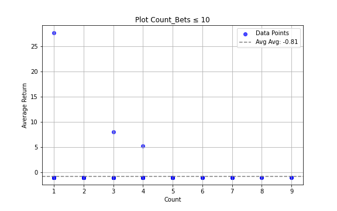
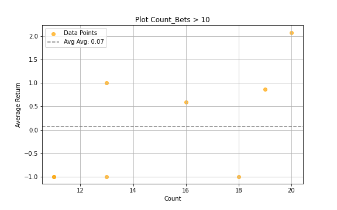
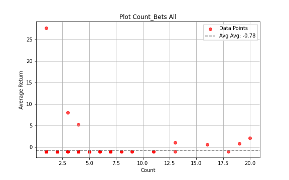

## Project Overview

This project involves scraping archived betting odds from a website using **Selenium** and then calculating the returns from a simulated betting strategy.

### Key Features:
- **Data Collection**: Scraping betting odds from a website using **Selenium**.
- **Betting Strategy**: The strategy involves distributing an equal amount of money across all bets on a specific date, where the payoffs exceed a set threshold.
- **Return Calculation**: The returns are calculated by evaluating the performance of the strategy based on the payoffs.

### How the Strategy Works:
1. **Data Scraping**: The script collects betting data for a given date, including three possible payoffs: Win (W), Draw (D), and Lose (L).
2. **Bet Selection**: For each date, the strategy selects all bets where at least one of the payoffs is higher than the chosen threshold.
3. **Simulated Betting**: Equal amounts of money are distributed to all qualifying bets.
4. **Result Calculation**: The returns are calculated based on the outcome of the bets.

### Outcome:
After simulating the strategy for different threshold values (i.e., the minimum payoff required to place a bet), the results show that, on average, the strategy yields **negative returns**.

## Betting Strategy Returns

The following scatter plots show the average returns for each betting strategy, plotted against the number of bets used for each result.

### 1. **Plot for Count_Bets ≤ 10**
This plot represents the returns for bets where the number of bets used is less than or equal to 10. The x-axis shows the number of bets, and the y-axis shows the return for each betting turn.

### 2. **Plot for Count_Bets > 10**
This plot shows the returns for bets where the number of bets used is greater than 10. Again, the x-axis shows the number of bets, and the y-axis shows the the return for each betting turn.

### 3. **Plot for All Bets**
This plot shows the returns across all betting strategies tested, with the x-axis representing the number of bets, and the y-axis representing the average return.

## Conclusion
From these plots, we can observe how for a specific thresholds (e.g. betting those that have payoffs greater than 24.5), picking such bets all simultaneously at the same date/time, it provides certain returns; the strategy generally results in negative returns.
